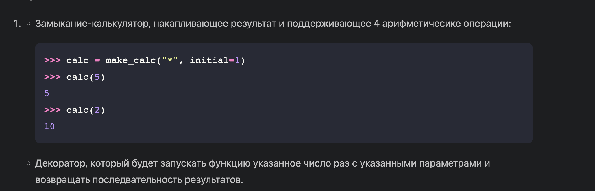
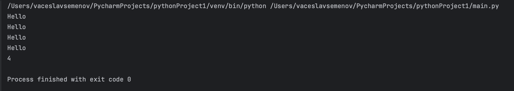

# Прог. Лабораторная работа №8
### Задания для самостоятельного выполнения
Сложность:
Rare
Решите обе задачи своего варианта.
Примените декоратор к замыканию.
Оформите отчёт в README.md. Отчёт должен содержать:
Условия задач
Описание проделанной работы
Скриншоты результатов
Ссылки на используемые материалы
## Задание


## Моё програмное решение
```pyton
def counter(func):
    def wrapper(*args, **kwargs):
        wrapper.count += 1
        return func(*args, **kwargs)

    wrapper.count = 0
    return wrapper


# Функция, вызовы которой нужно считать

@counter
def f():
    print("Hello")


f()
f()
f()
f()

print(f.count)
```

## результат моей программы



Ссылки на используемые материалы:
1.https://sky.pro/media/chto-takoe-dekoratory-v-python/
2.https://ru.hexlet.io/courses/python-functions/lessons/decorators/theory_unit